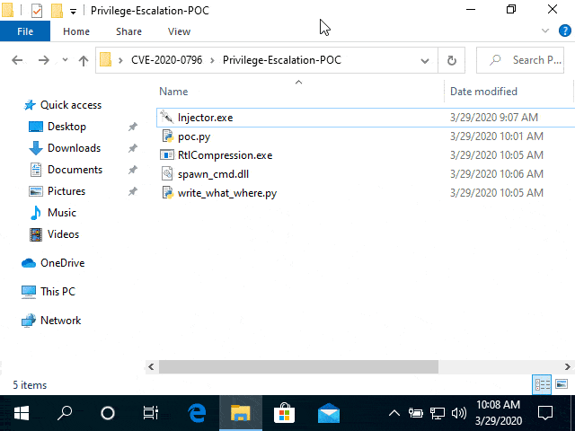

# CVE-2020-0796 Local Privilege Escalation POC

(c) 2020 ZecOps, Inc. - https://www.zecops.com - Find Attackers' Mistakes  
POC to check for CVE-2020-0796 / "SMBGhost"  
Expected outcome: cmd.exe launched with system access  
Intended only for educational and testing in corporate environments.  
ZecOps takes no responsibility for the code, use at your own risk.  
Please contact sales@ZecOps.com if you are interested in agent-less DFIR tools for Servers, Endpoints, and Mobile Devices to detect SMBGhost and other types of attacks automatically.

## Usage

Make sure Python is installed, then run `poc.py`.

## References

* [Exploiting SMBGhost (CVE-2020-0796) for a Local Privilege Escalation: Writeup + POC - ZecOps Blog](https://blog.zecops.com/vulnerabilities/exploiting-smbghost-cve-2020-0796-for-a-local-privilege-escalation-writeup-and-poc/)
* [Vulnerability Reproduction: CVE-2020-0796 POC - ZecOps Blog](https://blog.zecops.com/vulnerabilities/vulnerability-reproduction-cve-2020-0796-poc/)
* [CVE-2020-0796 - Microsoft Security Response Center](https://portal.msrc.microsoft.com/en-US/security-guidance/advisory/CVE-2020-0796)
